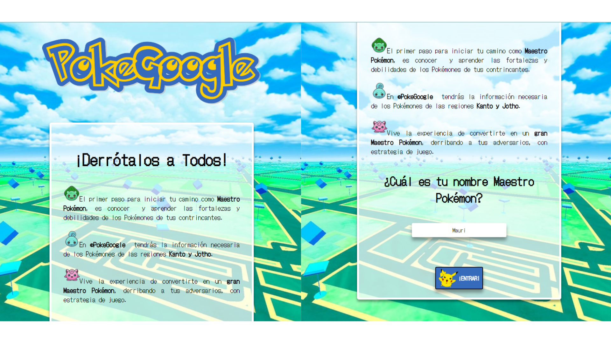
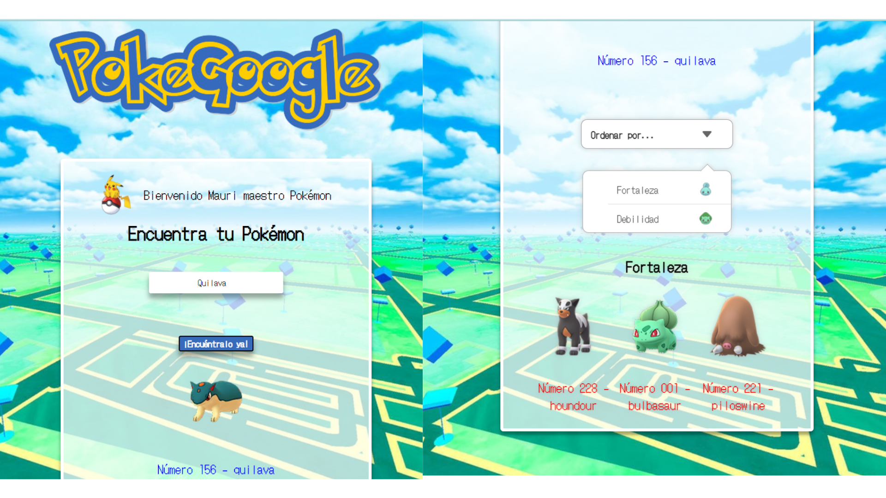

# POKEGOOGLE (Proyecto Data lovers)

## Resumen

**PokeGoogle** es una plataforma donde podrás encontrar información de los Pokémones de las regiones **Kanto y Jotho**. El maestro Pokémon (usuario) podrá ingresar su Pokémon con el cual se quiere enfrentar a duelo y ver cuales podrían ser sus futuros contrincantes,filtrando la información según las fortalezas o debilidades de estos. Permitiéndole preparar una mejor estrategia de juego frente a su oponente, asegurándole la victoria del combate Pokémon.

---

## Presentación

Experiencia usuario.

## Index para ingreso de usuario

## Buscador de pokemones y también filtro de fortalezas y debilidades

## Investigación UX

- La investigación fue llevada a cabo a través de encuestas a personas de distintas edades y género, teniendo un abanico de posibilidades nos ayudaría a ver más claramente cual sería nuestro público objetivo. La información recopilada es la siguiente:

### Principales usuarios

- Rango etario es : 13 años a > 50 años
- Mayormente el público es femenino 63%, hombres 37%
- Los jugadores de mayor porcentaje fueron personas que recién están entrando a este mundo, es un usuario de nivel 1 (LVL1). Por tanto son personas que necesitan y buscan información que les ayude a desenvolverse sin problemas en el juego Pokémon GO, ya que ahí utilizarían lo aprendido de nuestra app.

### Objetivos de estos usuarios en relación con el producto

- Los usuarios necesitan información clara y concisa, la cual les ayude formar un grupo de pokémones que les permita ganar una pelea contra otro entrenador.
- Sería una especie de preparación, antes de empezar un juego en Pokémon go.
- Le da la experiencia de ser un entrenador como el protagonista de la serie, Ash Ketchum y lo reconoce como tal.

### Diseño de Interfaz

- La parte visual tiene una parte importante, como son las imágenes y colores, al igual que la información / datos que necesita saber el usuario.
- La interfaz debe estar inspirada en la serie animada Pokémon, como también en el juego de Pokémon Go, por lo que la interfaz debe estar en la misma línea que estas.
- El otro punto es la entrega de información ,la cual les sirva para crear/armar su equipo, para el combate Pokémon en el juego Pokémon Go.

### Tiempos de uso

- Usarían nuestra app en sus tiempos de relajo y ocio.Un gran porcentaje dijo que usaría la app después del trabajo, los fines de semana,vacaciones y feriados. En resumen, cualquier tiempo libre que tenga la persona disponible.

### Prototipo de baja

- Una vez con la información recogida de la encuesta, se hizo el primer prototipo de baja, el cual fue testeado solo por el público objetivo con el cual trabajaríamos.

## Diseño

### Imagen de referencia

- El logo y el diseño de la app, se trabajo bajo la siguiente imagen de referencia, la cual pertenece al juego Pokémon Go, para que el usuario viera la relación que existe entre estas app.

### Logo

### Paleta de colores

### Prototipo de alta

- Se realizaron las modificaciones que fueron entregadas por los futuros usuarios mediante encuesta, para posteriormente desarrollar el prototipo de alta fidelidad. Este también fue testeado por el público objetivo, para afinar detalles, los cuales fueron considerados en el desarrollo de app.

### Historias de Usuarios

- Luego de la investigación realizada, se trabajo en las historias de usuarios, las cuales se ejecutaron en distintos Sprint durante el desarrollo del proyecto.
- Fueron en total 4 historias de usuarios, que se ejecutaron dentro de 5 Sprint.
- Cada historia usuario contaba con su criterio de aceptación y definición de terminado.
- La planificación se hizo mediante el software de administración de proyectos, TRELLO.

---

Proyecto realizado, durante los meses de Abril - Mayo 2022
